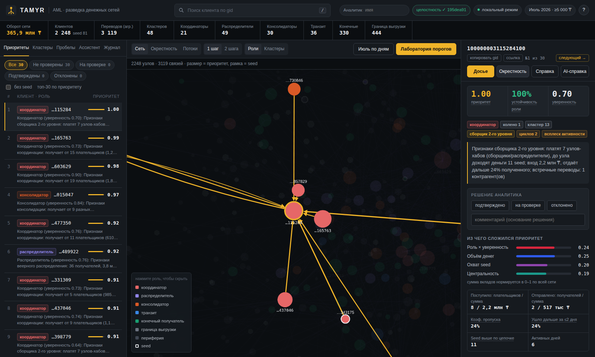
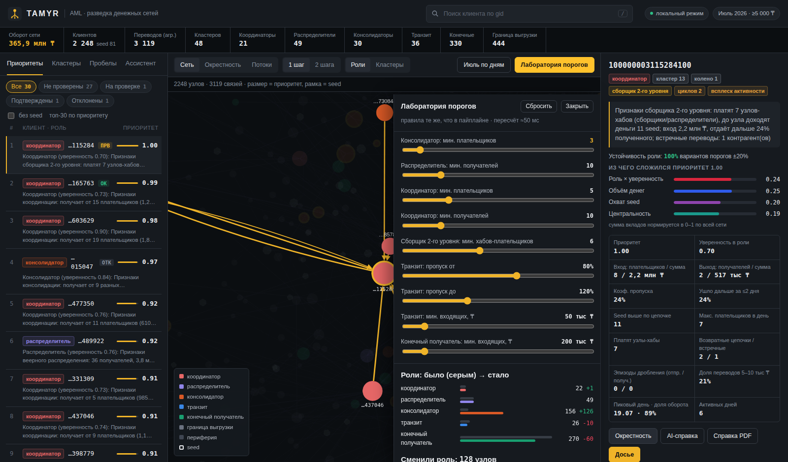
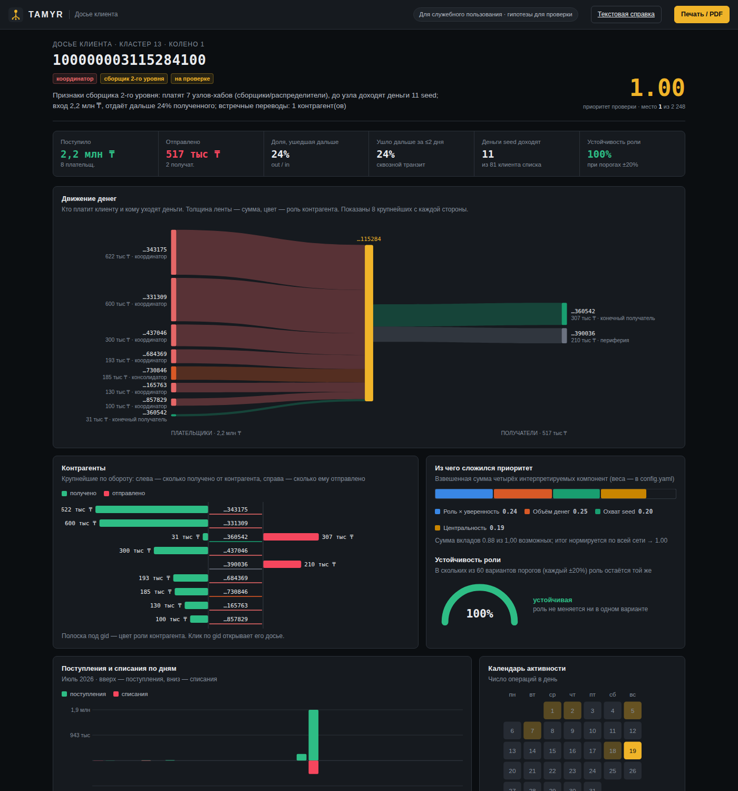
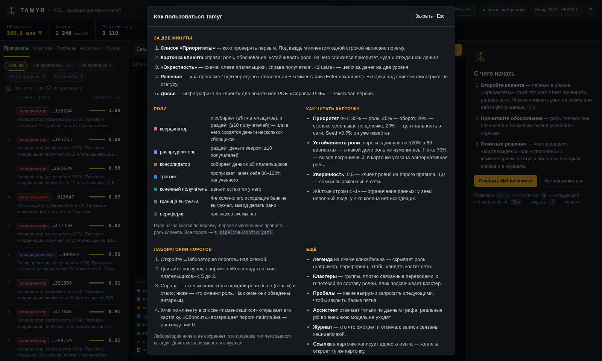
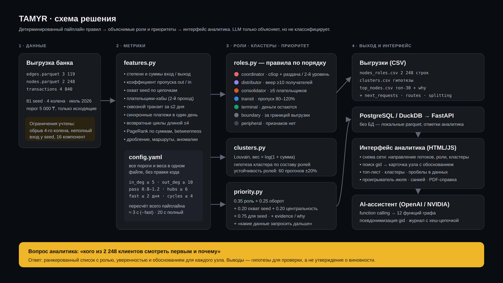
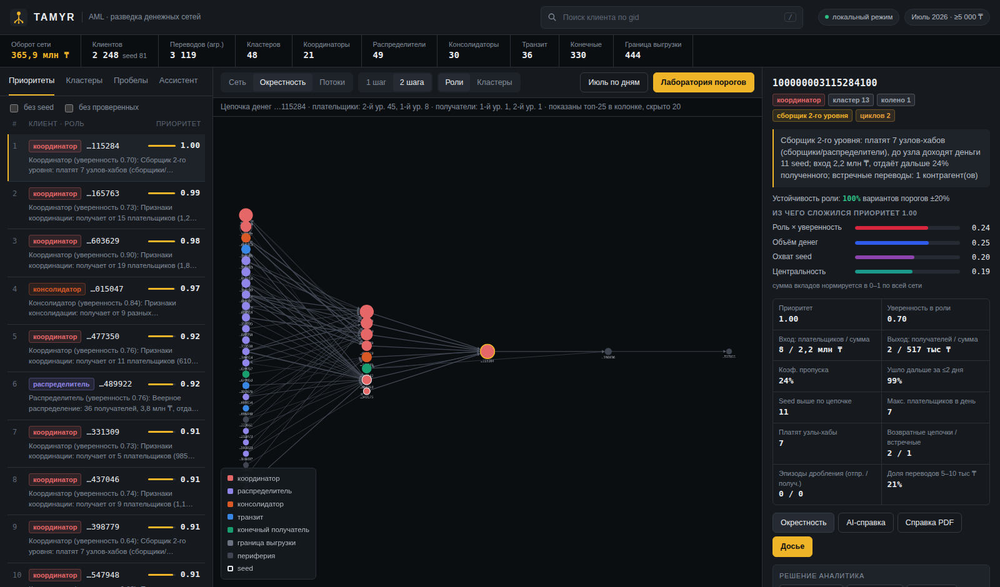
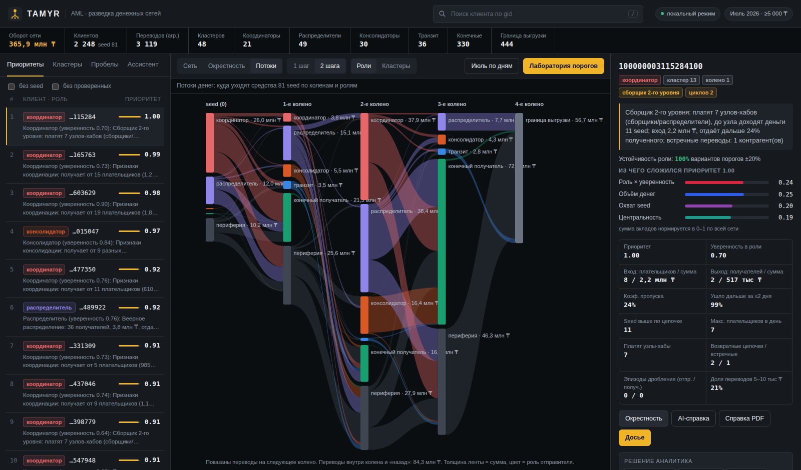
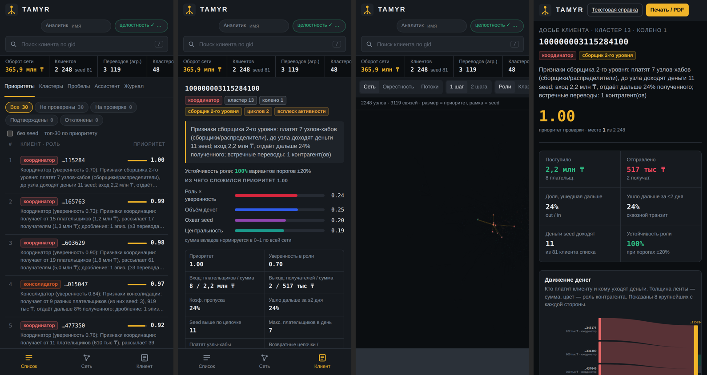

<p align="center">
  
</p>

<h1 align="center">TAMYR</h1>

<p align="center">
  <b>Разведка денежных сетей для AML-аналитика</b><br>
  <sub>каз. <i>тамыр</i> — корень, вена · находит корни схемы по её «курьерам»</sub>
</p>

<p align="center">
  
  
  
  
  
</p>

<p align="center">
  <a href="#быстрый-старт">Быстрый старт</a> ·
  <a href="#как-пользоваться-за-2-минуты">За 2 минуты</a> ·
  <a href="#чем-tamyr-отличается">Отличия</a> ·
  <a href="#как-работает">Как работает</a> ·
  <a href="#правила-ролей">Правила ролей</a> ·
  <a href="#почему-ролям-можно-доверять">Проверка</a> ·
  <a href="#безопасность-и-комплаенс">Безопасность</a> ·
  <a href="docs/DEMO.md">Сценарий демо</a>
</p>

---

Правоохранительные органы передают банку список из **81 клиента** — нижний уровень схемы, «курьеров».
Реальная сеть вокруг них — **2 248 клиентов** и **365,9 млн ₸** оборота за месяц. Вручную аналитик тратит часы на один узел.

**Tamyr за 20 секунд** строит граф переводов, присваивает каждому клиенту **объяснимую роль**, находит кластеры
и отвечает на главный вопрос: **кого проверять первым и почему**.

| | |
|---|---|
| **2 248 → 30** | топ-лист приоритетов с обоснованием по каждому клиенту |
| **6** | сборщиков второго уровня — узлов, куда стекаются деньги от других сборщиков |
| **97%** | средняя устойчивость ролей к изменению порогов на ±20% |
| **100%** | распознавание заложенной схемы с известными ролями, 0 ложных хабов на шуме |
| **10 узлов** | держат 16% оборота сети: их блокировка отрезает 12% клиентов, достижимых от seed |

> Все выводы — **гипотезы для проверки** («признаки консолидации»), а не утверждение о причастности клиента.

<p align="center"></p>

## Чем Tamyr отличается

**1. Лаборатория порогов — объяснимость, которую можно потрогать.**
Двигаете ползунок «консолидатор: минимум плательщиков» — через 50 мс граф перекрашивается, а панель показывает,
сколько клиентов сменили роль и кто именно. Лаборатория вызывает *ту же функцию правил*, что и пайплайн:
при исходных порогах расхождений 0.

<p align="center"></p>

**2. Досье клиента в инфографике.** Движение денег (плательщики → клиент → получатели), контрагенты «бабочкой»,
поступления и списания по дням, календарь активности, сальдо, размеры переводов, выявленные признаки,
устойчивость роли и разложение приоритета. Печатается в PDF для запроса в правоохранительные органы.

<p align="center"></p>

**3. Проверка без разметки.** Эталона ролей нет, поэтому мы проверяем обоснованность тремя независимыми способами:
устойчивость к порогам, заложенная схема в реальном графе и инварианты в автотестах ([подробнее](#почему-ролям-можно-доверять)).

**4. Честность к данным.** 444 клиента 4-го колена не превращаются в ложных «конечных получателей»: у них отдельная роль
`boundary`. У seed не считается коэффициент пропуска, а клиенты, отдающие больше, чем видно на входе, помечаются.
Вкладка «Пробелы» говорит, **какую выгрузку запросить следующей**.

**5. Безопасность и комплаенс «из коробки».** Внешняя LLM не видит ни одного реального gid (псевдонимизация),
каждое действие аналитика пишется в журнал с хеш-цепочкой, выводы привязаны к SHA-256 отпечаткам данных и кода,
строгая CSP и лимиты на AI. Всё проверяется автотестами ([подробнее](#безопасность-и-комплаенс)).

**6. Сборщики второго уровня.** Второй проход правил находит узлы, которым платят другие сборщики и распределители.
Клиент `…115284` — первое место в рейтинге: 7 хабов-плательщиков, деньги 11 seed.

## Быстрый старт

**Docker — пайплайн, PostgreSQL и интерфейс одной командой:**
```bash
cp .env.example .env          # ключ OpenAI или NVIDIA внутри — по желанию, только для AI-ассистента
docker compose up --build     # → http://localhost:8000
```

**Только выгрузки** (Python 3.11+):
```bash
pip install -r requirements.txt
python run.py --fast          # data/*.parquet → output/*.csv, ≈3 с
```

**Интерфейс без Docker и без базы** — данные читаются из `output/db/*.parquet` через DuckDB:
```bash
pip install -r requirements.txt
python run.py                 # ≈20 с: выгрузки, устойчивость ролей, укладка графа
uvicorn api.main:app --port 8000
```
API сам выбирает хранилище: PostgreSQL, если он доступен по `DATABASE_URL`, иначе локальные файлы.
Принудительно: `STORAGE=postgres` или `STORAGE=local`.

**Тесты и валидация:**
```bash
pip install -r requirements-dev.txt && pytest -q     # 14 тестов, ≈12 с
python scripts/validate_planted.py --runs 10          # отчёт → docs/validation.md
```

Данные кладутся в `data/`: `edges.parquet`, `nodes.parquet`, `transactions.parquet`.

## Как пользоваться за 2 минуты

1. Откройте http://localhost:8000. При первом входе покажется короткая справка (потом она доступна по кнопке **?** или клавише <kbd>?</kbd>).
2. Нажмите **«Открыть №1 из списка»** или любого клиента в «Приоритетах». В карточке справа — роль, обоснование,
   **устойчивость роли** (не зависит ли вывод от порогов) и из чего сложился приоритет.
3. **«Окрестность»** показывает, откуда пришли и куда ушли деньги; «2 шага» — цепочку на два уровня.
4. Поставьте решение **«на проверке / подтверждено / отклонено»** с комментарием (Enter сохраняет). Сразу предлагается
   перейти к следующему непроверенному; вкладки над списком фильтруют клиентов по статусу.
5. **Досье** — инфографика для печати в PDF. Кнопка **«ссылка»** копирует адрес карточки: коллега откроет того же клиента
   (`/#c=<gid>`), а «Назад» в браузере возвращает к предыдущему.

| Клавиша | Действие |
|---|---|
| <kbd>/</kbd> | поиск по gid (можно вставить полный gid и нажать Enter) |
| <kbd>↑</kbd> <kbd>↓</kbd> | следующий / предыдущий клиент в открытом списке |
| <kbd>N</kbd> | следующий непроверенный клиент из топ-листа |
| <kbd>E</kbd> · <kbd>D</kbd> | окрестность · досье выбранного клиента |
| <kbd>Esc</kbd> | закрыть справку, лабораторию, проигрыватель, карточку |

Легенда на схеме кликабельна: скройте «периферию» и «границу выгрузки» — останется костяк сети из ~470 клиентов.
В «Ассистенте» есть готовые вопросы; ответы строятся только по функциям графа.

<p align="center"></p>

## Как работает

<p align="center"></p>

```
data/*.parquet ──► pipeline (run.py) ──► output/*.csv                 обязательные выгрузки
                         │           └─► PostgreSQL | output/db → DuckDB
                         │                        │
   features → roles → stability/anomalies/routes → clusters → priority
                                                  ▼
                                      FastAPI (api/) ──► интерфейс (frontend/)
                                                  └──► AI-ассистент: 12 функций графа
```

**LLM не участвует в расчёте ролей.** Роли, скоры и кластеры детерминированы и считаются офлайн.
LLM (OpenAI или NVIDIA — `LLM_PROVIDER` в `.env`) работает только в интерфейсе: ассистент вызывает функции графа
через function calling и пересказывает результат со ссылками на gid.

### Выгрузки

| Файл | Содержание |
|---|---|
| `output/nodes_roles.csv` | все 2 248 клиентов: `gid, role, role_score, cluster_id, priority_score, evidence` |
| `output/clusters.csv` | `cluster_id, n_nodes, n_seed, sum_kzt_internal, top_gids, hypothesis` |
| `output/top_nodes.csv` | топ-30: `rank, gid, role, priority_score, why` |
| `output/nodes_metrics.csv` | все метрики каждого клиента — для разбора и проверки |
| `output/next_requests.csv` | какие данные запросить дальше |
| `output/splitting.csv` · `routes.csv` | эпизоды дробления · повторяющиеся маршруты A→B→C |

### Метрики клиента

| Метрика | Смысл |
|---|---|
| `in_deg` / `out_deg` | число уникальных плательщиков / получателей |
| `in_sum` / `out_sum` | сумма поступлений / списаний, ₸ |
| `pass_ratio` | `out_sum / in_sum` — какая доля полученного ушла дальше |
| `seed_payers` / `seed_reach` | сколько seed платят напрямую / от скольких seed деньги доходят по любой цепочке |
| `hub_payers` | сколько узлов-хабов (coordinator / consolidator / distributor) платят клиенту |
| `fast_share` | доля поступлений, ушедшая дальше за ≤2 дня (исходящие распределяются по поступлениям FIFO, без двойного счёта) |
| `burst_share` / `burst` | доля месячного оборота в самый активный день / всплеск (≥60% при ≥3 активных днях) |
| `max_payers_same_day` | максимум разных плательщиков за один день |
| `split_out` / `split_in` | эпизоды дробления: ≥3 перевода одному получателю в один день |
| `cycles` / `reciprocal` | возвратные цепочки длиной ≤4 / встречные пары A⇄B |
| `routes_mid` | в скольких повторяющихся маршрутах A→B→C клиент — посредник |
| `anomaly_score` | насколько суммы выбиваются из активных клиентов того же колена (robust z) |
| `role_stability` / `alt_role` | доля из 60 вариантов порогов ±20%, где роль сохраняется / частая альтернатива |
| `pagerank`, `betweenness` | центральность в сети (PageRank взвешен суммами) |
| `truncated` / `inflow_incomplete` | 4-е колено без выгруженных исходящих / вход виден не полностью |

## Правила ролей

Роли проверяются по порядку, клиент получает **первую** подходящую. Все пороги — в `pipeline/config.yaml`.

| # | Роль | Правило | role_score |
|---|---|---|---|
| 1 | **coordinator** | (а) `in_deg ≥ 5` **и** `out_deg ≥ 10` — собирает и раздаёт; (б) *второй проход*: консолидатор, которому платят `≥ 6` хабов и до которого доходят деньги `≥ 5` seed — **сборщик второго уровня** | (а) среднее насыщение по in/out; (б) 0.6·hub_payers + 0.4·seed_reach |
| 2 | **distributor** | `out_deg ≥ 10` — веерная рассылка | насыщение по out_deg |
| 3 | **consolidator** | `in_deg ≥ 5` — сбор с нескольких плательщиков | насыщение по in_deg + бонус за seed-плательщиков |
| 4 | **transit** | не seed, `in_sum ≥ 50 тыс`, есть исходящие, `0.8 ≤ pass_ratio ≤ 1.2` | близость к 1 + доля быстрого пропуска |
| 5 | **terminal** | не на границе выгрузки, (`out_deg = 0` или `pass_ratio ≤ 0.2`), (`in_sum ≥ 200 тыс` или `in_deg ≥ 2`) | перцентиль in_sum |
| 6 | **boundary** *(расширение)* | 4-е колено, исходящих нет — судьба денег неизвестна | 0.9 |
| 7 | **peripheral** | ничего из перечисленного | 1 − близость к порогам |

«Насыщение» = 0.5 ровно на пороге и 1.0 на максимуме по сети (логарифмическая шкала).
Если нужен строго базовый словарь ролей — `use_boundary_role: false` в конфиге.

**Приоритет:**
```
priority = 0.35 · (вес роли × role_score) + 0.25 · перцентиль оборота
         + 0.20 · перцентиль охвата seed + 0.20 · перцентиль центральности
priority ×= 0.75 для seed (уже известны — фокус на тех, кто выше по цепочке)
```
Веса ролей: coordinator 1.0 · consolidator 0.85 · distributor 0.8 · transit 0.6 · terminal 0.45 · boundary 0.3 · peripheral 0.1.

**Кластеры:** Louvain на неориентированном графе, вес ребра `log(1 + сумма)`, `seed=42`. Клиенты без переводов ≥5 000 ₸ —
кластер 0. Гипотеза кластера строится по составу ролей: число seed, главный сборщик, распределители, транзит, оборот.

## Почему ролям можно доверять

| Способ | Результат |
|---|---|
| **Устойчивость к порогам** — 60 пересчётов, каждый порог сдвигается на ±20% | средняя 97%; coordinator 93%, distributor 90%, consolidator 71% (самая чувствительная). 94 клиента с устойчивостью < 70% помечены как «пограничные» с альтернативной ролью |
| **Заложенная схема** — в реальный граф встраивается группа с известными ролями и контрольный шум ([отчёт](docs/validation.md)) | 10 прогонов: все роли распознаны в 100% случаев, 4-е колено не принимается за конечных получателей, 0 ложных хабов |
| **Инварианты в автотестах** (`tests/`) | каждая роль удовлетворяет своему правилу, seed никогда не transit, результат детерминирован |
| **Лаборатория порогов** | жюри и аналитик могут сами изменить любой порог и увидеть последствия |
| **Отметки аналитика** | «подтверждено / на проверке / отклонено» копят разметку для будущей калибровки |

Честная оговорка: заложенную схему составили мы сами, поэтому она показывает, что правила работают как задуманы и не
срабатывают на шуме. Соответствие реальным группам подтверждается разбором аналитика.

## Безопасность и комплаенс

Инструмент работает с досье клиентов банка, поэтому защищён он сам, а не только данные в нём.

| Угроза | Мера | Как проверить |
|---|---|---|
| Утечка данных клиентов во внешнюю LLM | **Псевдонимизация**: перед отправкой каждый gid заменяется на `К-001, К-002…`, модель вызывает инструменты псевдонимами, реальные gid подставляются только в ответ аналитику. Таблица соответствия живёт в памяти одного запроса | `pytest tests/test_security.py::test_llm_never_sees_real_gids` — имитация OpenAI, проверяется всё, что ушло наружу |
| Prompt-injection через вопрос или данные | Системный промпт помечает содержимое инструментов как данные, а не инструкции; из истории принимаются только роли user/assistant; длина вопроса ≤ 2000 символов; вызываются только инструменты из белого списка; LLM не участвует в расчёте ролей | `test_prompt_history_is_sanitized` |
| Незаметная правка журнала или отметок задним числом | **Журнал действий с хеш-цепочкой**: кто открыл карточку/досье/справку, сменил статус, запускал лабораторию, спрашивал ассистента. Каждая запись содержит SHA-256 предыдущей | вкладка «Журнал» · `GET /api/audit/verify` · `test_audit_chain_detects_tampering` |
| Подмена входных данных или выводов после расчёта | **Отпечатки целостности**: `output/manifest.json` с SHA-256 входных parquet, конфига, кода и выгрузок; интерфейс сверяет их при каждом запуске, отпечаток печатается в досье и справке | индикатор «целостность ✓» в шапке · `GET /api/integrity` · `test_integrity_detects_changed_output` |
| XSS, кликджекинг, утечка через Referer | Строгая **CSP** без внешних источников и inline-скриптов, `X-Frame-Options: DENY`, `nosniff`, `Referrer-Policy: no-referrer`; ответы API не кэшируются (`no-store`); экранирование всех данных в интерфейсе | `curl -I localhost:8000/` · `test_security_headers_and_validation` |
| Перерасход ключа LLM, перебор | Лимит 20 запросов к AI в минуту с адреса (`LLM_RATE_PER_MIN`), ответ 429 | — |
| Неавторизованный доступ | Опциональный токен `API_TOKEN` (сравнение за постоянное время); без него — режим демо. Схема API (/docs) не публикуется | задать `API_TOKEN` в `.env` → интерфейс попросит токен |
| Некорректный ввод | gid — только цифры (404), пороги — только из белого списка (400), `n` ограничен | `test_security_headers_and_validation` |
| Утечка секретов | Ключи только в `.env` (в `.gitignore` и `.dockerignore`); заглушки из шаблона не принимаются за ключ | — |
| Персональные данные | Идентификаторы обезличены; ФИО, ИИН и другие ПДн не используются и не выводятся | — |
| Работа без интернета | Пайплайн, интерфейс, PDF работают офлайн; cytoscape.js лежит локально, внешних CDN нет | — |

Для промышленного внедрения следующий шаг — SSO банка вместо токена, роли «аналитик / руководитель» с принципом
четырёх глаз для статуса «подтверждено», отправка журнала в SIEM и проверка зависимостей (`pip-audit`) в CI.

## Учёт ограничений данных

| Ограничение | Как учтено |
|---|---|
| Обрыв на 4-м колене (444 клиента) | роль `boundary`, а не ложный `terminal`; в «Пробелах» — какие исходящие запросить |
| Только исходящие переводы | флаг `inflow_incomplete`, оговорка в evidence, карточке и досье |
| У seed занижены входящие | seed не бывает transit; коэффициент пропуска для seed не используется |
| Порог 5 000 ₸ | дробление ниже порога невидимо — указано как ограничение |
| 19 seed без переводов | все в `nodes_roles.csv`, кластер 0 с гипотезой |
| 16 компонент связности | Louvain по всем компонентам. В оценке устойчивости сети считаем 35 компонент: 16 связных + 19 seed без переводов |
| Нет разметки | проверка через устойчивость, заложенную схему и тесты |

## Интерфейс

| Экран | Что даёт |
|---|---|
| **Приоритеты** | рейтинг клиентов с ролью, приоритетом и обоснованием; вкладки по статусу проверки, фильтр «без seed», навигация клавишами |
| **Карточка клиента** | роль, evidence, устойчивость роли, разложение приоритета, признаки, контрагенты, решение аналитика; ссылка на карточку, «следующий непроверенный» |
| **Окрестность / цепочка денег** | 1 шаг — плательщики слева, получатели справа; 2 шага — два уровня вверх и вниз по цепочке |
| **Потоки** | санкей: куда уходят средства seed по коленам и ролям |
| **Июль по дням** | проигрыватель переводов по дням на схеме сети |
| **Лаборатория порогов** | живой пересчёт ролей при изменении порогов |
| **Кластеры · Пробелы** | гипотезы по кластерам, устойчивость сети при блокировке топ-N, что запросить дальше |
| **Журнал** | кто и что смотрел или менял; проверка целостности цепочки |
| **Досье · Справка PDF** | инфографика по клиенту и текстовая справка для запроса |
| **Ассистент** | вопросы на естественном языке, ответы только по функциям графа |

<p align="center"> </p>

**Адаптивный интерфейс:** три колонки на широком экране, выезжающая карточка на планшете, одна колонка
с нижней навигацией «Список · Сеть · Клиент» на телефоне. Досье на телефоне прокручивает широкие диаграммы по горизонтали.

<p align="center"></p>

**AI-ассистент** (OpenAI / NVIDIA, function calling): `get_node`, `get_neighbors`, `common_receivers`, `trace_path`,
`top_nodes`, `cluster_summary`, `simulate_removal`, `find_cycles`, `find_splitting`, `find_routes`, `anomalies`, `next_requests`.
В чате видна цепочка вызванных функций; формулировки — гипотезы.

## Масштабирование до ~1 млн клиентов

- **Вычисления:** networkx → igraph / graph-tool / cuGraph; betweenness — аппроксимация по выборке; Louvain → Leiden.
- **Охват seed:** один BFS от каждого seed с битовыми масками вместо `ancestors` для каждого узла.
- **Хранение:** PostgreSQL с партиционированием по периоду или графовая БД (Neo4j / Memgraph); агрегаты — материализованные представления.
- **Инкрементальность:** пересчёт метрик только для клиентов, затронутых новыми транзакциями; роли — правилами поверх них.
- **Интерфейс:** кластеры как супер-узлы, раскрытие по запросу; укладка заранее на сервере; устойчивость ролей — выборочно для топ-N.

## Ограничения подхода

- Пороги подобраны по распределениям этой выгрузки; для другого периода или банка их нужно перекалибровать (лаборатория порогов помогает).
- Роли определяются по структуре и суммам. Без атрибутов клиента и типа операции возможны ложные срабатывания (например, бизнес-счета с множеством плательщиков).
- Видны только внутрибанковские переводы: цепочки через другие банки и наличные не видны.
- Выгрузка охватывает один месяц (июль 2026): регулярность видна только внутри месяца, сезонность и долгие схемы — нет.
  Пайплайн от периода не зависит, но графики по дням в интерфейсе рассчитаны на один календарный месяц.

## Структура репозитория

```
run.py                       точка входа пайплайна
pipeline/config.yaml         все пороги и веса
pipeline/core.py             порядок шагов пайплайна
pipeline/features.py         метрики, дробление, циклы
pipeline/roles.py            правила ролей + evidence
pipeline/extra.py            устойчивость ролей, аномалии по колену, маршруты A→B→C
pipeline/clusters.py         кластеризация + гипотезы
pipeline/priority.py         приоритет, топ-лист, «что запросить дальше»
pipeline/db.py               загрузка в PostgreSQL
pipeline/integrity.py        отпечатки SHA-256 данных, конфига, кода и выгрузок
api/                         FastAPI: REST, PostgreSQL/DuckDB, лаборатория порогов, AI-ассистент,
                             журнал (audit.py), псевдонимизация (privacy.py), защита (security.py)
frontend/                    интерфейс (HTML/CSS/JS + cytoscape.js локально), dossier.html, report.html
scripts/validate_planted.py  валидация на заложенной схеме
tests/                       pytest
docs/                        схема решения, сценарий демо, отчёт валидации, скриншоты
```

---

<p align="center"><sub>Команда <b>California Gurls</b> · HackAlem AI 2026 · кейс «Граф денег»</sub></p>
